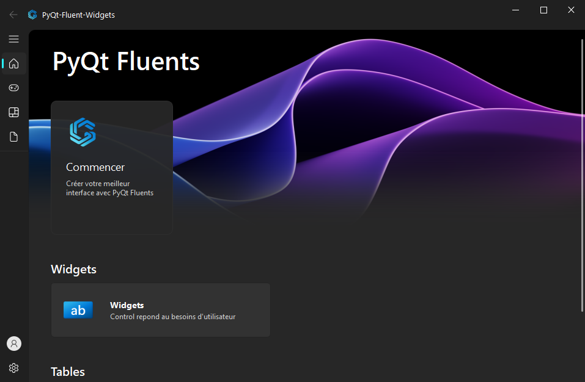
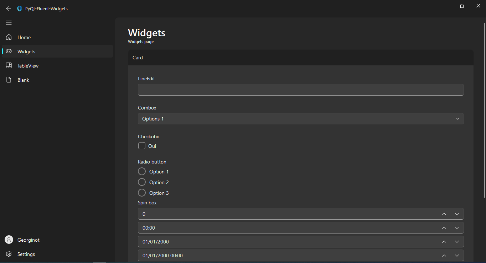
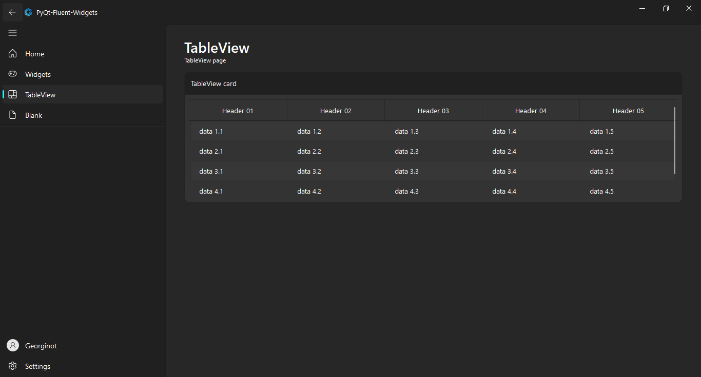
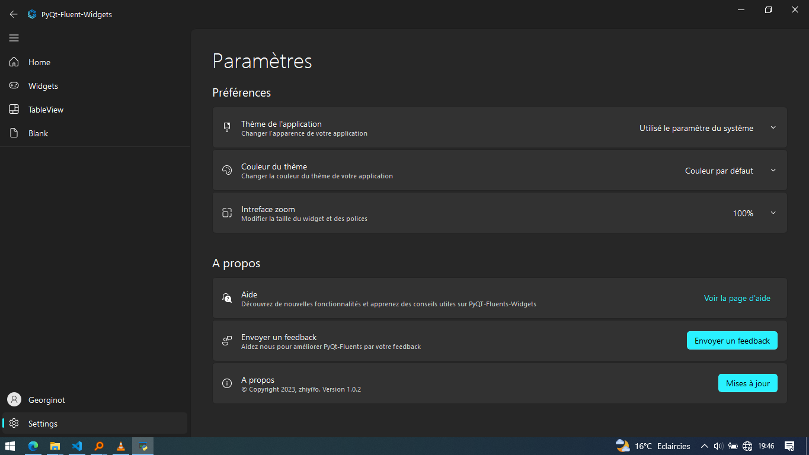

# Modern GUI for python
This interface is inspired by design windows11 Microsoft

### Screenshots






### Requirements
#### Installation Library
```console
pip install PyQt5
pip install qfluentwidgets
```
### Run
```console
python main.py
```


